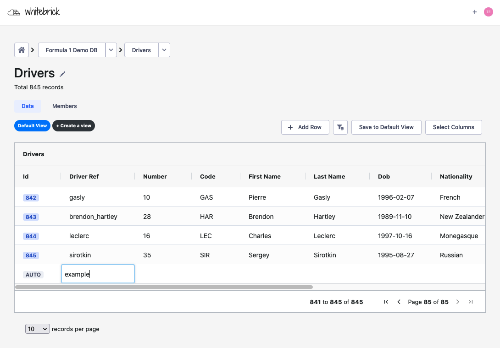
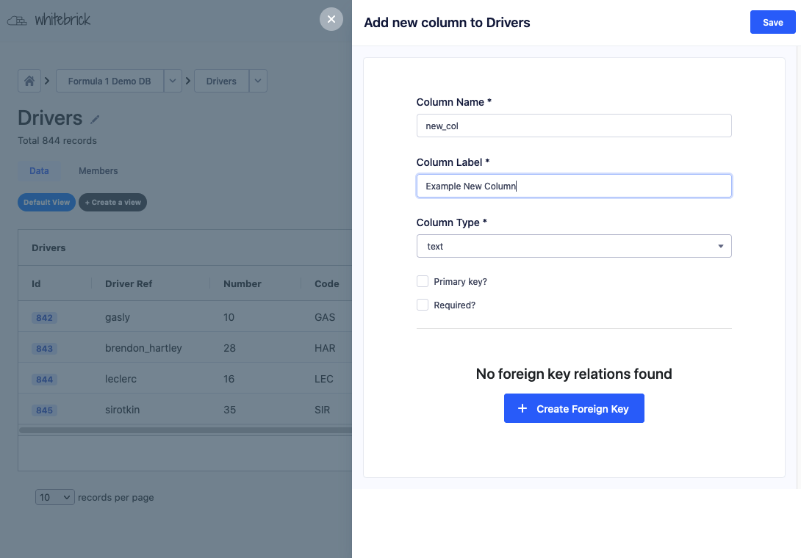
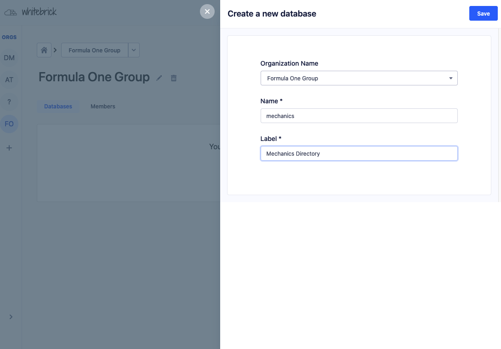
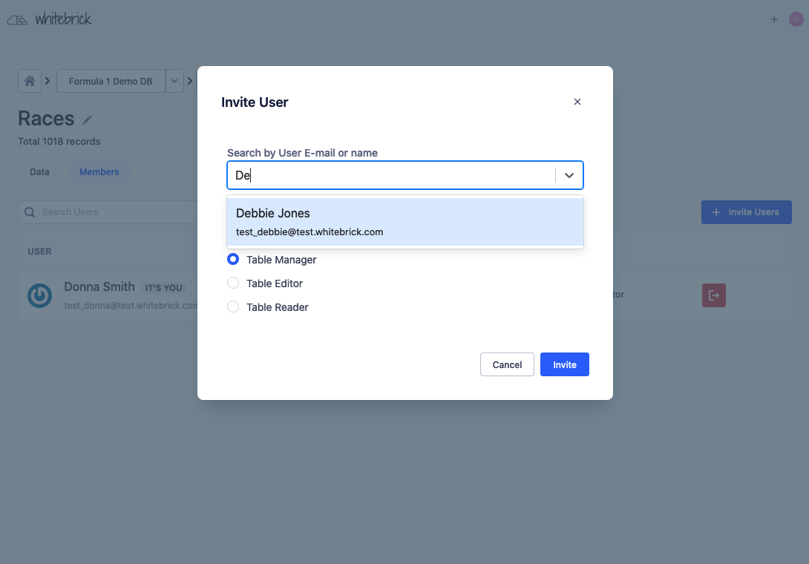
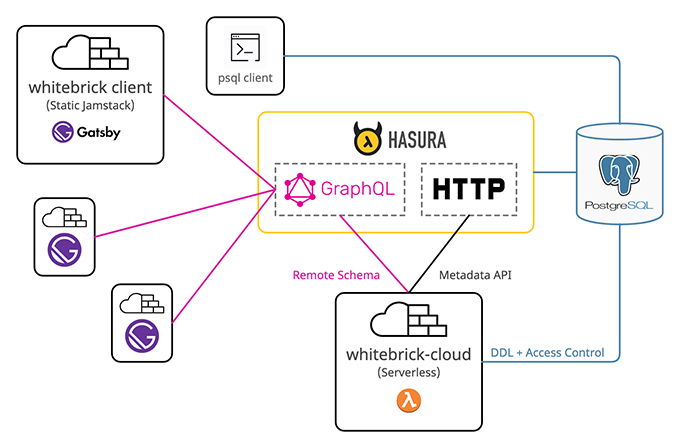

# whitebrick (front end) BETA

<!-- START:HEADER ================================================== -->

### Open Source Airtable Alternative (No Code DB)

|  |  |  |  |
| :----------------------------------------------------: | :----------------------------------------------------: | :----------------------------------------------------: | :----------------------------------------------------: |
|               <sub>Adding a record</sub>               |              <sub>Creating a column</sub>              |                <sub>Creating a DB</sub>                |               <sub>Managing access</sub>               |

#### Whitebrick is a lightweight No Code Database with 3 points of difference:

1. The front end uses a [Gatsby static Jamstack](https://www.gatsbyjs.com/) client for dead easy customization and deployment.
2. The back end is a set of [Serverless functions](https://www.serverless.com/) for making DDL calls to [PostgreSQL](https://www.postgresql.org/) and configuring [Hasura GraphQL server](https://hasura.io/).
3. The [PostgreSQL](https://www.postgresql.org/) database schemas can be accessed directly with **_psql_** for data import/export and integrations with other tools.

##### Rather than reinventing the wheel Whitebrick stitches together the best-in-breed open source apps:

[Hasura](https://hasura.io/) | [Gastsby](https://www.gatsbyjs.com/) | [PostgreSQL](https://www.postgresql.org/) | [AG Grid](https://ag-grid.com/) | [Apollo](https://www.apollographql.com/) | [Serverless](https://www.serverless.com/)

---

#### Current Project status as of November:

We're currently fixing bugs and trying to get the Beta release stable.

Please use GitHub [Issues](https://github.com/whitebrick/whitebrick/issues) to report bugs and [Discussions](https://github.com/whitebrick/whitebrick/discussions) for questions, features and suggestions.

:point_right: **Background Job UI** - when a new column or new table is added/updated Hasura needs to re-track the schema and because this can take some time it is processed in the background. We currently do not have any progress indicator and instead just a "Please try again in a minute" message which is tedious to use.

**Roadmap:**

- [x] DDL Table & Column CRUD
- [x] Live editing with subscription
- [x] Table-level RBAC
- [x] Joins
- [x] Background process queue
- [ ] Background process UI
- [ ] UI styling and themes
- [ ] Psql reader/writer access
- [ ] Validations
- [ ] Bucket file download columns
- [ ] Column-level RBAC

Hosted demo at [whitebrick.com](https://whitebrick.com)

<!-- END:HEADER ================================================== -->

---

#### Licensing

<!-- START:LICENSING ================================================== -->

Whitebrick is [licensed](https://github.com/whitebrick/whitebrick-cloud/blob/main/LICENSE) under the MIT License however the dependencies use a variety of different licenses. We are working on a simple guide to outline the license information and options by use case - TBD.

<!-- END:LICENSING ================================================== -->

---

### You are currently viewing the front end client repository (whitebrick)

- The back end repository can be found [here](https://github.com/whitebrick/whitebrick-cloud)
- Documentation can be found [here](https://hello.whitebrick.com/docs)



<!-- START:SUMMARY ================================================== -->

Whitebrick comprises a [front end Gatsby Jamstack](https://github.com/whitebrick/whitebrick) client and [back end Serverless](https://github.com/whitebrick/whitebrick-cloud) application (whitebrick-cloud) that adds multi-tenant DDL and access control functions to a [PostgreSQL](https://www.postgresql.org/) Database via the [Hasura](https://github.com/hasura/graphql-engine) GraphQL Server. The Jamstack client uses [AG Grid](https://ag-grid.com/) as a spreadsheet-like UI that reads/writes table data directly from/to Hasura over GraphQL. Additional functions (eg DDL and access control) are provided by whitebrick-cloud and exposed through the same Hasura endpoint using [Schema stitching](https://hasura.io/docs/latest/graphql/core/remote-schemas/index.html).

<!-- END:SUMMARY ================================================== -->

<!-- START:TECHNICAL_OVERVIEW ================================================== -->

### Hasura

Hasura is a server application that automatically wraps a GraphQL API around a standard PostgreSQL relational database.
Hasura is written in Haskell and can be easily deployed directly from a Docker image.
The server comes with a web GUI admin console that allows the underlying database to be browsed and _tracked_ so that it can be accessed over GraphQL.
Hasura also provides a WebSocket endpoint for subscription queries.

**Database Queries**

Whitebrick queries Hasura to display table data and to update table records. When table data is queried, paginated, sorted and updated (mutated) this is all managed by Hasura over GraphQL.

**Schema Stitching**

Hasura can also _stitch_ schemas together and pass requests on to other external endpoints. When Whitebrick requests DDL functions such as adding a new table or column, Hasura passes this request on to the Whitebrick Cloud Serverless app and then returns the response through the same single GraphQL endpoint.

**Metadata API**

Hasura provides a separate HTTP API that allows database metadata to be programmatically updated and refreshed. For example, when Whitebrick Cloud executes DDL commands to add a column to a table, it then calls this Hasura API to update the metadata so the new column can be tracked and queried over GraphQL.

**Authentication & Authorization**

Because Hasura stitches together multiple APIs under the one unified endpoint it is well placed to manage authentication and authorization. Hasura integrates with authentication providers such as Auth0 by checking for role variables encoded in JWTs with each request. Hasura also provides functionality to set permissions at a column level so checks can be configured to look-up user records for authorization.

### Whitebrick Cloud (back end)

The Whitebrick Cloud back end is a set of functions written in Javascript using the Apollo GraohQL interface and executed on a Serverless provider. Whitebrick Cloud connects with the PostgreSQL database to make DDL calls such as creating new tables and columns. After mofifying the database Whitebrick Cloud then calls the Hasura Metadata API to _track_ the corresponding columns and tables. Whitebrick Cloud also manages additional metadata, background jobs, user permissions and settings, persisting them in a dedicated schema.

### Whitebrick (front end)

The Whitebrick front end is statically compiled Jamstack client written in Gatsby/React/Javascipt and uses AG Grid as the data grid GUI. Whitebrick sends GraphQL queries and mutations to the Hasura endpoint and displays the returned data. Because the client is statically compiled it can be easily customized by front end developers and deployed to any web site host.

<!-- END:TECHNICAL_OVERVIEW ================================================== -->

---

## Getting Started

<!-- START:FRONTEND_SETUP ================================================== -->

### Running Locally

1. **Install Gatsby**

    ```
    npm init gatsby
    ```

    Further information from Gatsby [here](https://www.gatsbyjs.com/docs/quick-start/)

2. **Clone this repository**

    ```
    git clone git@github.com:whitebrick/whitebrick.git
    ```

3. **Configure the Client**

    ```
    cp .env.example .env.development
    vi .env.development

    GATSBY_HASURA_GRAPHQL_URL=https://graph.whitebrick.com/v1/graphql
    GATSBY_HASURA_GRAPHQL_WSS_URL=wss://graph.whitebrick.com/v1/graphql
    GATSBY_AUTH0_DOMAIN=auth.whitebrick.com
    GATSBY_AUTH0_CLIENT_ID=sc0K4pJGgyNZ5x9L27POwgfXPsCZPtJZ
    GATSBY_AUTH0_CALLBACK=https://whitebrick.com/home/index.html
    GATSBY_AUTH0_AUDIENCE=https://production-whitebrick.us.auth0.com/api/v2/
    # IF HOSTING YOUR OWN CLOUD BACK END:
    # GATSBY_HASURA_GRAPHQL_ADMIN_SECRET=MyHasuraSecret
    ```

4. **Start Gatsby**

    ```
    npm run develop
    ```

    Gatsby will start a hot-reloading development environment accessible by default at http://localhost:8000.

### Gatsby Shadowing

TBD

<!-- END:FRONTEND_SETUP ================================================== -->

---

<!-- START:LINKS ================================================== -->

- [Web](https://whitebrick.com/)
- [Documentation](https://hello.whitebrick.com/docs)
- [Discord](https://discord.gg/FPvjPCYt)
- [Medium](https://towardsdatascience.com/towards-a-modern-lims-dynamic-tables-no-code-databases-and-serverless-validations-8dea03416105)

<!-- END:LINKS ================================================== -->
